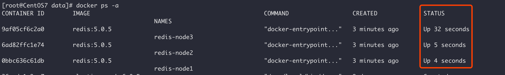

###<center>基于Docker的Redis集群搭建</center>

1、拉取镜像

    docker  pull  redis:5.0.5

2、创建Redis容器

创建三个 redis 容器：

* redis-node1：6379
* redis-node2：6380
* redis-node3：6381

        docker create --name redis-node1 -v /data/redis-data/node1:/data -p 6379:6379 redis:5.0.5 --cluster-enabled yes --cluster-config-file nodes-node-1.conf

        docker create --name redis-node2 -v /data/redis-data/node2:/data -p 6380:6379 redis:5.0.5 --cluster-enabled yes --cluster-config-file nodes-node-2.conf

        docker create --name redis-node3 -v /data/redis-data/node3:/data -p 6381:6379 redis:5.0.5 --cluster-enabled yes --cluster-config-file nodes-node-3.conf


3、启动并组建集群
启动容器

首先通过命令<font color="red">docker start</font>来启动3个Redis容器：


启动成功后如下图所示：





查看3个Redis在Docker中分配的ip结点信息：

```buildoutcfg
执行「docker inspect redis-node1」得到 redis-node1 ip 信息为：172.17.0.4 执行「docker inspect redis-node2」得到 redis-node2 ip 信息为：172.17.0.3 执行「docker inspect redis-node3」得到 redis-node3 ip 信息为：172.17.0.2
```


拿到 ip 信息后（每个人的ip信息可能不一样），接下来进入某一个容器进行组建集群：


```buildoutcfg
# 这里以进入 node1 为例
docker exec -it redis-node1 /bin/bash

# 接着执行组建集群命令（请根据自己的ip信息进行拼接）
redis-cli --cluster create 172.17.0.2:6379  172.17.0.3:6379  172.17.0.4:6379 --cluster-replicas 0

```


###测试集群

ok，此时集群搭建完了，我们接下来测试一下。

使用 <font color="red">redis-cli -c</font> 命令连接到集群结点，然后 set 值，set 值之后会自动重定向到 0.2 ip地址，然后通过 get 获取一下，获取成功证明集群有效。


